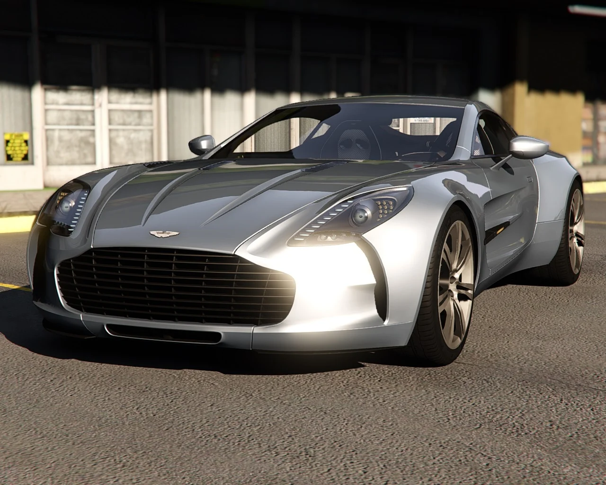
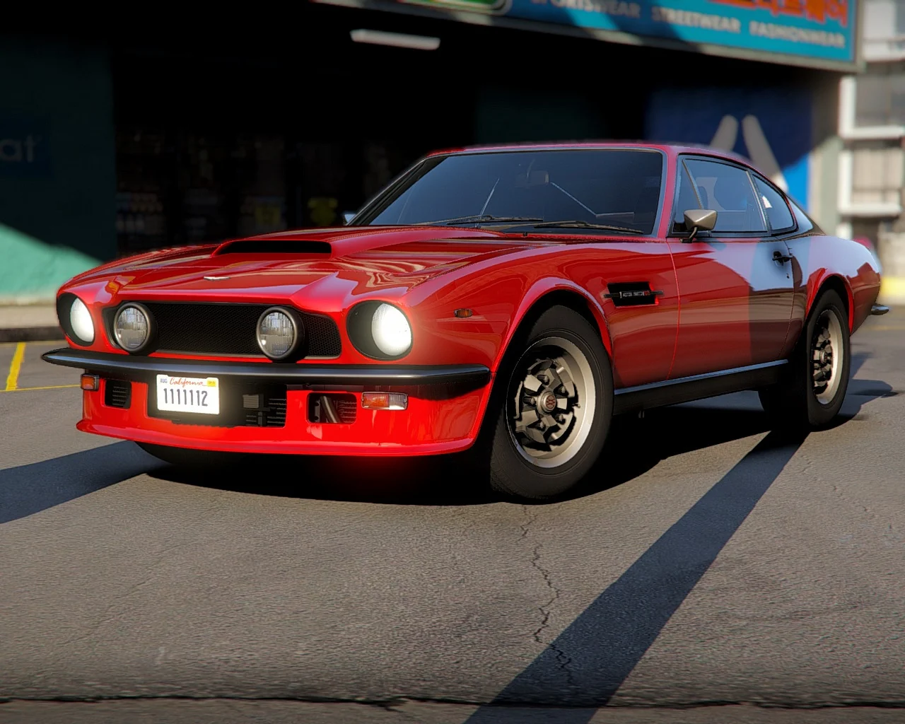
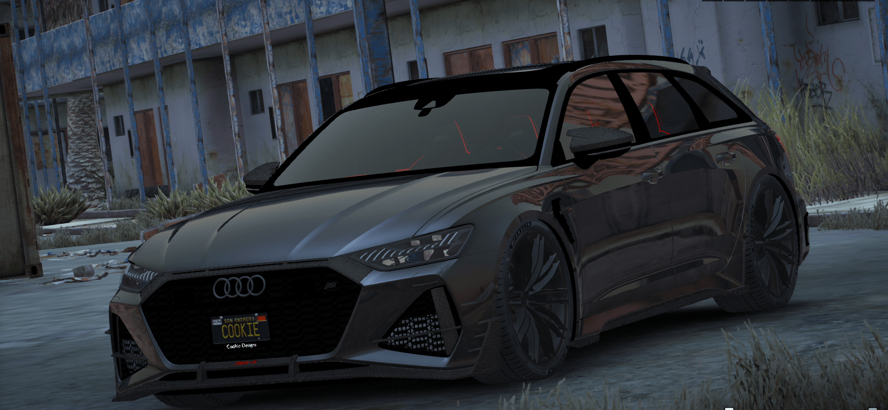
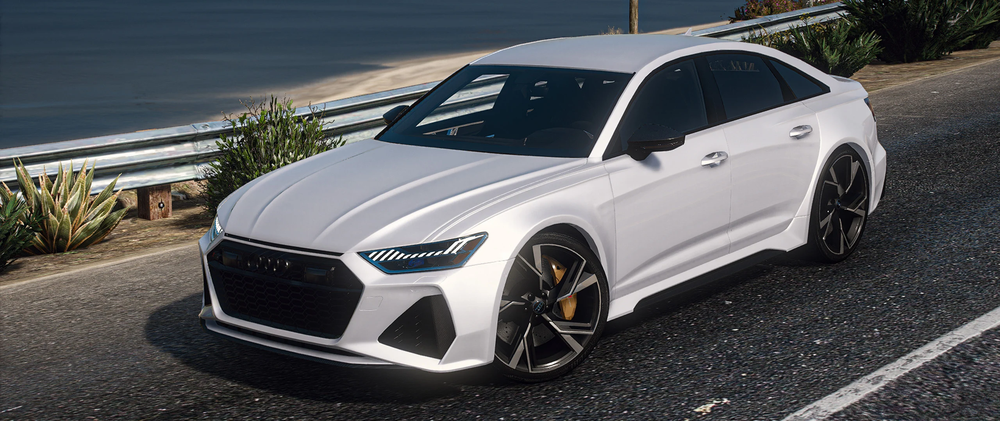
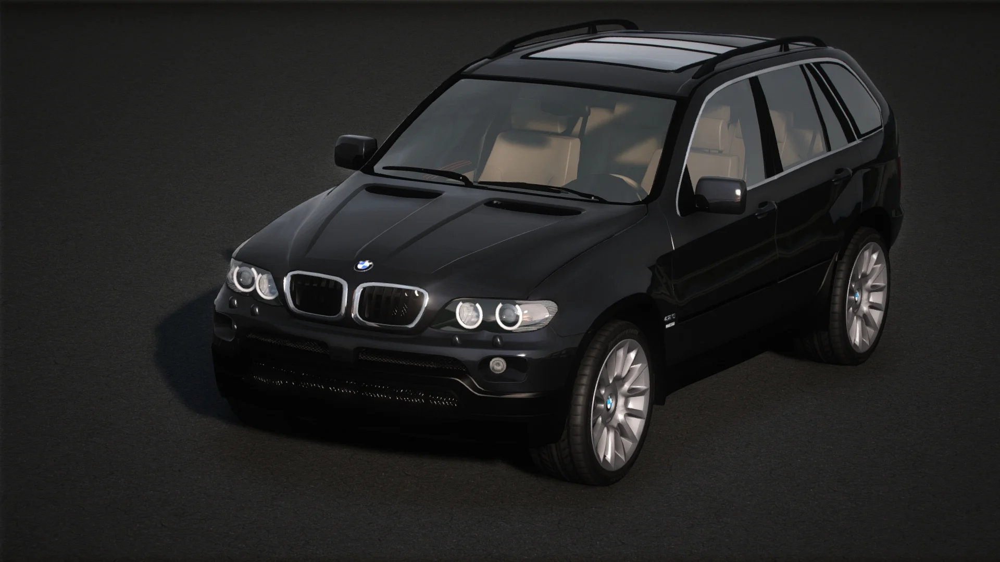
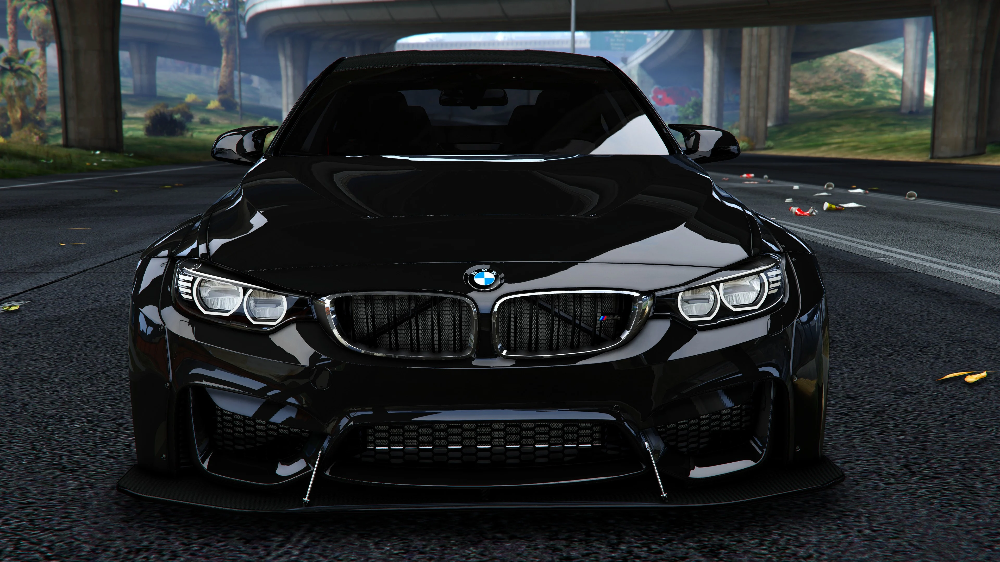
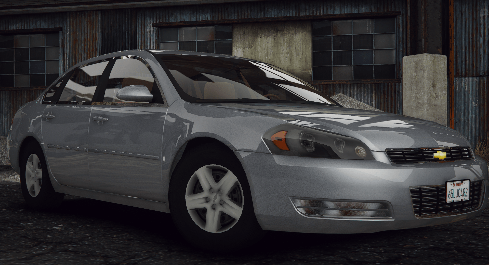
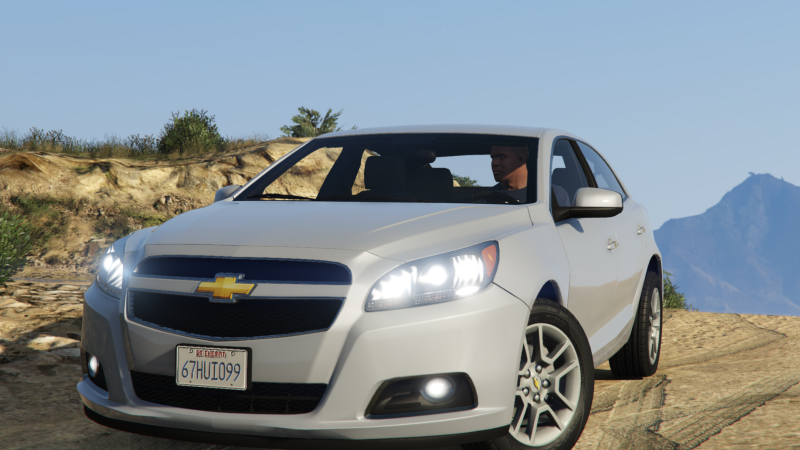
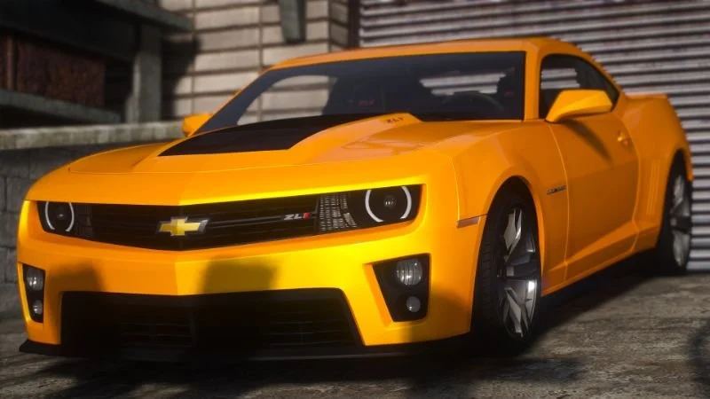
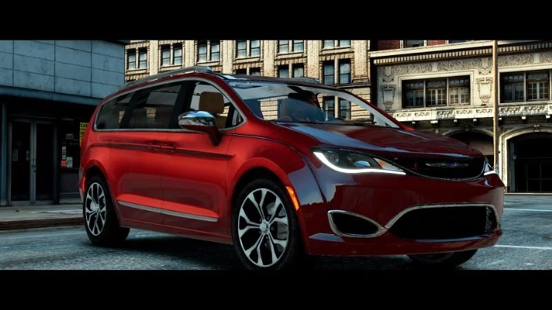

# FiveM_Car_Pack_CIV
A car pack for your server civilians, this pack is more of cars you would see in everyday life. (Instead of 30+ super cars)

Please note these cars where not developed by our organization all authors are cridited below. Also note this pack layout & configuration setup is heavily inspired by - [PLOKMJNB/FiveM-Civ-Car-Pack](https://github.com/PLOKMJNB/FiveM-Civ-Car-Pack)

### Support & Requesting NEW Cars!
- [Discord](https://github.com/PLOKMJNB/FiveM-Civ-Car-Pack/wiki/VPS-installation) join our Community Discord for help if need & for requesting cars.

### How To Install The Cars
- [Click here](https://github.com/PLOKMJNB/FiveM-Civ-Car-Pack/wiki/VPS-installation) to see the wiki page for how to install the proper way

### vMenu
- If vMenu is installed on your server, every vehicle in the pack will show under "Addon Vehicles"
- You must update vMenu's addons.json file with all the vehicle names (see this [this example](example_vmenu_addons.json))

| Car Name | Spawn Code  | Link to Picture | Author | Authors Download Link[5MODS](https://gta5-mods.com/) or [LSPDFR](https://www.lcpdfr.com/) | Status | Extra Notes |
| :-: | :-: | :-: | :-: | :-: | :-: | :-: |
| **2010 Aston Martin One-77** | aone |  | 00AbOlFaZl00 | [5MODS Link](https://www.gta5-mods.com/vehicles/2010-aston-martin-one-77-add-on-template) | ✔️ |
| **Aston Martin V8 Vantage 1977** | v877 |  | Abolfazldanaee | [5MODS Link](https://www.gta5-mods.com/vehicles/aston-martin-v8-vantage-1977-add-on-template-extras) | ✔️ |
| **2020 Audi RS6** | cookiers6a |  | cookierich | [5MODS Link](https://www.gta5-mods.com/vehicles/audi-rs6-2020-abt-add-on-fivem-tuning) | ✔️ |
| **2021 Audi RS6 Sedan** | rs6c8 |  | ahmeda1999 | [5MODS Link](https://www.gta5-mods.com/vehicles/2021-audi-rs6-sedan-c8-add-on) | ✔️ |
| **2006 BMW X5** | E53 |  | HRH | [5MODS Link](https://www.gta5-mods.com/vehicles/2006-bmw-x5-4-8is-individual-e53-fl-add-on-replace-tuning-extras) | ✔️ |
| **BMW M4 GTS Liberty Walk** | rmodm4gts |  | Rmod Customs | [5MODS Link](https://www.gta5-mods.com/vehicles/bmw-m4-gts-liberty-walk) | ✔️ |
| **2022 BMW M5 Competition** | 22m5 |  | RAZ3R_BLAD3 | [5MODS Link](https://www.gta5-mods.com/vehicles/2022-bmw-m5-compe) | ✔️ |
| **2017 Cadillac CTS V** | C2017 |  | Amir Onyx | [5MODS Link](https://www.gta5-mods.com/vehicles/cadillac-cts-v-2017-add-on) | ✔️ |
| **2010 Chevrolet Impala LS** | impala10 |  | Kpym | [5MODS Link](https://www.gta5-mods.com/vehicles/chevrolet-impala-2010-add-on-replace-fivem-lods) | ✔️ |
| **2013 Chevrolet Malibu** | 13malibu |  | RAZ3R_BLAD3 | [5MODS Link](https://www.gta5-mods.com/vehicles/2013-chevrolet-malibu-add-on) | ✔️ |
| **2012 Camaro ZL1** | camarozl1 |  | TacoPoPo | [5MODS Link](https://www.gta5-mods.com/vehicles/2012-camaro-zl1-add-on-fivem-template-lods) | ✔️ |
| **2020 Chrysler Pacifica Limited** | pacifica |  | jrem7315 & GTA Graphica | [5MODS Link](https://www.gta5-mods.com/vehicles/2020-chrysler-pacifica-limited) | ✔️ |
